# P6 security-review packet (input to issue #34)

This packet turns the **#34** "no-central-key-custody / template safety model" review from a
discussion thread into a **PR-C-ready adjudication checklist** for P6 (automated discovery
sources). It is the review agenda; its output should be a set of decided rows a PR C author can
build against. Design context: `docs/P6-discovery-sources-spec.md` + `docs/adr/ADR-004-*.md`.

## Hard gate (in force until #34 produces the adjudication below)

Until this review is complete and the decisions in §5 are made:

- `ADR-004` stays **Proposed**;
- **no** P6 production workflow is created;
- **no** dormant "secure it later" code is written;
- **no** prototype/experimental path bypasses the gate;
- **no** write-capable token, GitHub App, or workflow permission is provisioned.

#34 must end in a decision list (§5) + accepted acceptance-tests (§2), not just a thread.

## 1. Trust-boundary diagram

```mermaid
flowchart LR
  F["Untrusted feeds (RSS/Atom)"] -->|"https, pinned URLs only"| J1
  subgraph J1["JOB 1 fetch/parse (permissions empty, NO secrets)"]
    A1["fetch: no-redirect, connect-time IP check, no proxy, timeout, size caps"]
    A2["XXE-safe parse: no entities/DTD/XInclude, depth + expansion bounded"]
    A3["extract github.com owner/repo via normalizeGithubUrl"]
  end
  J1 -->|"size-bounded strict-schema intermediate (UNTRUSTED assertions)"| J2
  subgraph J2["JOB 2 resolve (read-only STAR_SYNC_TOKEN, clean checkout)"]
    B1["re-validate: schema + C4 caps + re-normalize"]
    B2["re-derive provenance; mint observed_at (trusted side only)"]
    B3["aggregate: manual + new-web + retained prior-web"]
    B4["resolve, public-only gate C7, node_id dedupe vs stars.json, decisions"]
    B5["serialize + dataset_sha, then verify"]
  end
  J2 -->|"verified artifact pair + enumerated reason codes"| J3
  subgraph J3["JOB 3 publish (write, ONLY after verify)"]
    C1["base-commit-SHA guard; single open PR"]
  end
  J3 -->|"PR, never pushes main"| H["Human review + merge"]
  H --> M[("main / dashboard")]
```

Invariant: nothing an untrusted feed emits reaches `main`/the dashboard except a candidate that
resolved to a real **public** repo via the owner's read-only token, is not already starred, and a
**human** approved in a PR. A source is a pure producer; the three capability stages are **separate
jobs**, not steps.

## 2. PR C deferred-item checklist (each becomes an acceptance test)

These were surfaced by cross-model review (rounds 1–3) and **owner-deferred to PR C** (deferred,
not dismissed). PR C MUST satisfy each; #34 confirms them.

- [ ] **Cross-job artifact extraction hardened** — bind download to the exact producing job's
      artifact id/digest; extract into an isolated non-checkout dir under compressed + expanded
      size limits; accept only the expected regular file(s) (reject symlinks, traversal, extra
      entries, special files); validate before any token-bearing step; never execute artifact
      contents; publish re-runs `verify` after download.
- [ ] **Resolve re-derives provenance** — trusted side binds `kind==='web'`, matches
      `source_id`/`source_url` to the checked-out feed config, is the **sole** minter/reuser of
      `observed_at`, and independently enforces the `raw_ref` bound/escape. Producer provenance is
      an untrusted hint. (Honest limit: this binds identity, not extraction truth.)
- [ ] **Every C4 cap has a decided direction** — see §3; per-ceiling behavior + fail-closed tests.
- [ ] **Pending-PR state machine** — pick (a) treat an open discovery PR's validated pair as
      additional retained input with compare-and-swap on both base-`main` SHA and PR-head SHA, or
      (b) refuse further writer runs while a PR is open; a PR whose base `main` moved is rebuilt by
      a fresh resolve run; an all-quarantined run still emits a `$GITHUB_STEP_SUMMARY`.
- [ ] **Protected-branch pin** — resolve/publish check out the default/protected branch SHA, not an
      arbitrary `workflow_dispatch` ref; the quarantine reason-code set is a fixed enumeration.
- [ ] **Untrusted-input → GitHub-write trust boundary** proven end-to-end (no feed byte reaches a
      write action un-revalidated).
- [ ] **Token / permissions minimized** per job (`permissions:{}` on fetch/parse; `contents:read`
      on resolve; write only on publish).
- [ ] **Artifact identity / freshness / replay protection** — the intermediate and the published
      pair cannot be replayed or substituted across runs.
- [ ] **Trusted GitHub-write templates only** — PR title/body/comment and commit messages are
      composed only of trusted static templates, normalized `owner/repo`, trusted-side-derived
      provenance, fixed enumerated reason codes, and bounded numeric fields; they never include or
      quote a feed title, description, HTML, free text, a producer-supplied message, or any raw feed
      bytes (the GitHub write action must not amplify untrusted feed text).

## 3. Proposed C4 cap table (directions decided; NUMBERS need owner sign-off)

The **direction** per ceiling is decided in the spec; the **numeric value** is for the owner to set
in `config/ai.yaml`-style config or code constants during PR C.

| Ceiling                                              | Over-limit direction                                                           | Provisional value (owner confirms in #34) |
| ---------------------------------------------------- | ------------------------------------------------------------------------------ | ----------------------------------------- |
| non-https / userinfo / private-IP-literal feed URL   | config **fail-closed**                                                         | n/a                                       |
| feed count                                           | config **fail-closed**                                                         | 25                                        |
| feed URL / `source_url` length                       | config **fail-closed** (never truncate)                                        | 2,048 chars                               |
| per-feed wire / decompressed bytes                   | **per-feed quarantine**                                                        | 2 MiB / 8 MiB                             |
| per-feed item count                                  | **per-feed quarantine**                                                        | 200                                       |
| XML nesting depth                                    | **per-feed quarantine**                                                        | 32                                        |
| extracted URLs per item                              | deterministic truncate + fixed reason code                                     | 20                                        |
| `raw_ref` length                                     | **per-item quarantine/reject** (never truncate)                                | 512 chars                                 |
| `source_id` length                                   | config **fail-closed** (never truncate)                                        | 128 chars                                 |
| `sources[]` per candidate                            | first-seen first; retained-source overflow **fails closed**                    | 8                                         |
| total candidates per run                             | retained-first admit-and-surface; retained-alone-over-ceiling **fails closed** | 300                                       |
| resolve budget (logical repos) / per-request timeout | budget exhaustion **aborts publication**                                       | 300 / 10 s                                |
| total-run wall-clock                                 | **abort publication**                                                          | 20 min                                    |
| intermediate compressed / expanded artifact size     | **fail-closed** (reject the artifact)                                          | 2 MiB / 8 MiB                             |

**Cap-consistency invariant.** The maximum legal output of the field / `sources[]` / candidate caps must be compatible with the expanded-artifact cap, the resolve budget, and the total-run wall-clock; where they are not, the **outer** cap (artifact size / budget / wall-clock) is the earlier **fail-closed** ceiling with a fixed reason code — never a silent truncation. These are a conservative P6.1 starting point, not permanent limits; widening them is a later PR with hosted-validation evidence.

## 4. Attack / failure test matrix (PR C ships a test per row)

| #   | Attack / failure                                                        | Control (spec)                  | Expected outcome                                                                                                          |
| --- | ----------------------------------------------------------------------- | ------------------------------- | ------------------------------------------------------------------------------------------------------------------------- |
| 1   | Parser RCE / malicious dependency in fetch/parse job                    | C1 job split                    | No token, no write, no shared workspace; can only poison the intermediate, which resolve re-validates.                    |
| 2   | Poisoned intermediate (traversal / symlink / zip-bomb)                  | §2 item 1                       | Rejected at bounded extraction before any token step.                                                                     |
| 3   | Forged `source_id`/`source_url`/`observed_at`/`raw_ref`                 | §2 item 2 (C1/C6)               | Resolve re-derives from trusted config; forged attribution dropped.                                                       |
| 4   | SSRF via item link / redirect / DNS-rebinding / userinfo / proxy        | C2                              | Fetch refuses (config-parse or connect-time); no internal request.                                                        |
| 5   | XXE / billion-laughs / external DTD / gzip bomb                         | C3 + C4 caps                    | Entity-disabled parse; decompressed-byte cap; per-feed quarantine.                                                        |
| 6   | Resolver amplification (thousands of refs) / hang                       | C5                              | Deadline + concurrency + logical-repo budget; transient → abort publication.                                              |
| 7   | Private-repo metadata leak via token visibility                         | C7                              | `private===false`/not-disabled gate drops it before serialize.                                                            |
| 8   | Ephemeral feed drop-out silently deletes pending candidate              | Aggregation retention           | Web candidate retained until decision/star/authoritative-resolve.                                                         |
| 9   | Manual run wipes web candidates                                         | Aggregation (all writers)       | Manual workflow re-emits config + retains web candidates.                                                                 |
| 10  | Stale / lossy pending PR (candidate exists only in PR)                  | §2 item 4                       | Base-SHA guard + single-PR + pending-PR rule; no silent loss.                                                             |
| 11  | Self-consistent forged artifact pair                                    | C8 (honest residual)            | `verify` won't catch it — **the human PR review is the gate**; no auto-merge.                                             |
| 12  | Unchanged run churns the artifact                                       | Provenance stability            | first-seen `observed_at` + canonical `sources[]` → byte-identical.                                                        |
| 13  | Malicious feed title/description (Markdown, mentions, prompt injection) | C6 trusted-write-templates (§2) | Raw text never reaches PR title/body/comment or commit message; only normalized `owner/repo` + fixed reason codes appear. |

## 5. Decisions requiring owner approval (the #34 output)

1. **Pending-PR mechanism** — §2 item 4 option (a) vs (b).
2. **All C4 numeric values** — the "owner sets" column in §3.
3. **RSS/Atom parser dependency** — a specific well-audited library that meets the C3 contract, or
   hand-rolled. (Names a supply-chain surface — decide deliberately.)
4. **Single-open-PR policy** — "update the existing PR branch" vs "close-and-reopen".
5. **`future-web` retirement horizon** — it stays a deprecated, never-emitted, still-valid member;
   confirm it is only ever removed in a future major `DISCOVERY_SCHEMA_VERSION` bump.
6. **Credential-bearing future sources (YouTube/Telegram)** — confirm the ADR-amendment + fresh-#34
   requirement before any such source is designed; no repo-owned-credential plumbing lands in P6.1.
7. **Schedule** — P6.1 ships `workflow_dispatch`-only; a `schedule` is a later, separate decision
   after hosted validation.

**Owner's provisional leanings (recorded for #34 to confirm — NOT approved decisions):** pending-PR
= option (b), refuse further writer runs while a discovery PR is open; base-`main` moved =
close-and-reopen (mark the old PR superseded, rebuild from the new base — no state-machine stacking
on the old branch); parser = a maintained, well-audited dependency with fixed safe settings (no
hand-rolled XML tokenizer / entity handling; the feed-to-domain mapping may be hand-written);
`future-web` removed only in a future major `DISCOVERY_SCHEMA_VERSION`; credential-bearing sources
require an ADR amendment + fresh #34, with no dormant credential plumbing in P6.1; schedule decided
only after hosted validation. #34 ratifies or overrides each.

When every §5 row is decided and every §2 item accepted as a PR-C acceptance test, #34 can close as
"P6.1 authorized" and `ADR-004` moves from Proposed to Accepted. Not before.
